# Container diagram — Project Relay (C4 level 2)

```mermaid
flowchart LR
    user([ADTI Employee])
    admin([ADTI Administrator])

    subgraph Relay[Project Relay]
        api[/"Relay.Api<br/>ASP.NET Core 8"/]

        subgraph Modules
            intranet["Intranet module<br/>(Domain + App + Infra)"]
            documentum["Documentum module<br/>(Domain + App + Infra)"]
            webselect["WebSelect module<br/>(Domain + App + Infra)"]
        end

        subgraph BuildingBlocks
            sharedkernel["SharedKernel"]
            crosscutting["CrossCutting<br/>(logging, auth, events)"]
            infracore["Infrastructure.Core<br/>(IDbExecutor, resilience)"]
        end

        bus(["In-process IEventBus"])
    end

    db[("SQL Server<br/>schemas: intranet.* / documentum.* / webselect.*")]
    ad(("Active Directory<br/>(OIDC / SAML)"))
    obs{{"Logs &#43; traces<br/>(Serilog sinks)"}}

    user -->|HTTPS/JSON| api
    admin -->|HTTPS/JSON| api

    api --> intranet
    api --> documentum
    api --> webselect

    intranet --> sharedkernel & crosscutting & infracore
    documentum --> sharedkernel & crosscutting & infracore
    webselect --> sharedkernel & crosscutting & infracore

    intranet --- bus
    documentum --- bus
    webselect --- bus

    intranet --> db
    documentum --> db
    webselect --> db

    api --> ad
    api --> obs
```

## Notes

- A module's box represents its four projects (`Domain`, `Application`,
  `Infrastructure`, `Contracts`). Cross-module arrows go **only** through
  another module's `Contracts` project.
- The in-process `IEventBus` is drawn as a shared channel but is a single
  in-memory dispatcher; replacing it with a broker is a composition-root
  change only.
- `SQL Server` is one physical instance at launch; each module resolves its
  connection string by name, so a module can later move to its own database
  or server without code changes.
