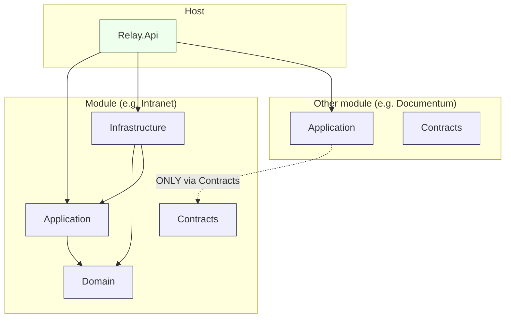

# Module layer dependency rules

## Rules enforced by `tests/Architecture`

1. `*.Domain` does not reference `AspNetCore`, `SqlClient`, or
   `Infrastructure.Core`.
2. `*.Domain` does not reference any other module's projects.
3. `*.Application` of module X may reference module Y **only** through
   `Y.Contracts`.
4. `*.Infrastructure` of module X does not reference `Infrastructure` of
   any other module.
5. Handler, validator, and repository types follow their naming conventions
   (`*CommandHandler`, `*QueryHandler`, `*Validator`, `*Repository`).

A violation of any of these rules fails the CI build, not just a review
comment.
